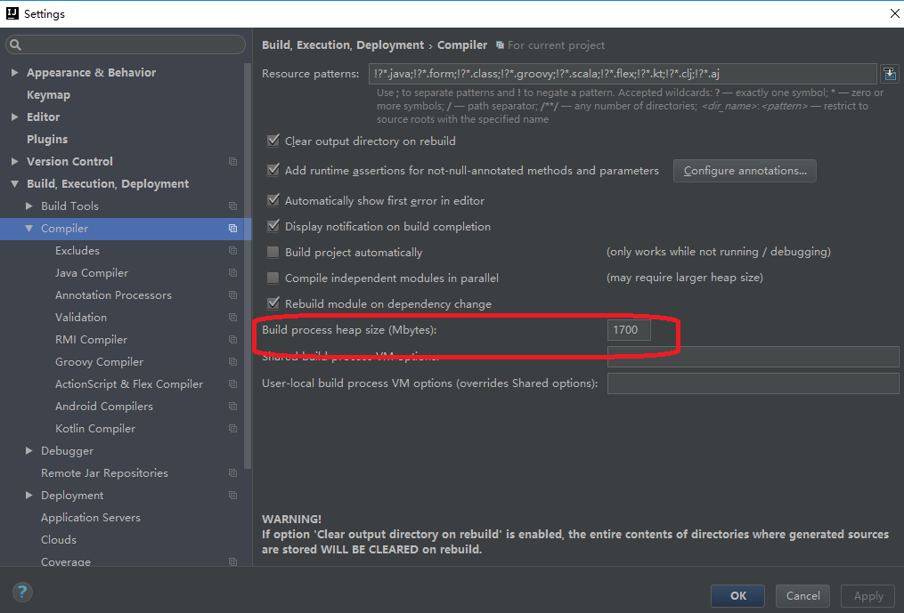

# Java8 源码阅读环境搭建
	
**1、找到JDK安装包所在目录，会看到src.zip的压缩包，这里面就是JDK的源码，如下图。**

**把 src.zip 解压到 src 文件夹下**

**2、新建一个简单的Java工程**
打开idea，菜单栏File => Project，出现如下图

下一步

下一步

完成

**3、在新建项目 src 下新建 source 文件夹，把解压后的 src 文件夹下的文件拷贝到 source 文件夹下，如下图 **

##### 3.1 在test 下新建一个测试类，我们现在建一个 HashMapTest ，写一个测试，然后启动调试，如下图

##### 3.1 错误 1  内存不足错误

 
 内存不足打开 idea 设置 build compiler --> build process heap size 把默认 700 调整为 1700 或更大

##### 3.2 错误 2 找不到 UNIXToolkit 找不到sun.font.FontConfigManager

解决缺少的这两个类，可以去[OpenJDK（传送门）](http://openjdk.java.net/) 拷贝

找到UNIXToolkit类，将 UNIXToolkit 类中的内容( 传送门)拷贝到项目的src\main\java\下，新建“sun\awt”包中的新建“UNIXToolkit.java”中

找 FontConfigManager 类 在sun.font 下 同 UNIXToolkit 操作。

到此已解决sun.awt.UNIXToolkit找不到的错误

##### 3.3 调试进入不到源码 ，设置 build--> debugger--> steping --> Dot not step into the cless 去掉勾选

##### 3.3 源码不能编辑
file--> project Structure --> SKDs 新添加一个sdk，选择 jdk安装目录 ，然后更改 `Sourcepath` 删除src.zip 源码路径，添加 本项目下source 文件目录源码

##### 3.4 添加tools.jar 到 Libraries

##### 3.5 删除 SDKs 下 `ClassPath` rt.jar， 在 Libraries 下添加 `rt.jar`

